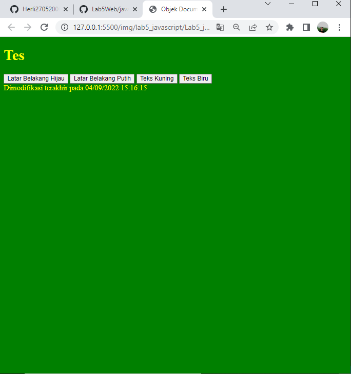

## Mohammad Sofiyan
## 312010225
## TI.20.A2
## PERTEMUAN 6
## LAB 5 WEB
dipertemuan kali ini kita akan mempalajai **javasciript** pada html, seperti penempatan **javascript** pada html di internet ataupun eksterminal **javascript** 
# 1.PERSIAPAN MEMBUAT DOKUMENT HTML DENGAN MANA FILE lab5_javascript.html seprti berikut. 
## TAMPILAN DIBROWSER NYA!

## PENJELASAN 
Disini adalah hasil dari output dengan menggunakan elemen javascript **documen.write** dan console.log namaun untuk **console.log** tidak di tampilkan dibrowser, ada fitur khusus untuk menampilkannya seperti di bawah.

ini adalah output console.log seperti terlihat kanan bawah,terdapat fitur console dan didalamnya ada script hello word.
**kode html**
```html 
<!DOCTYPE html >
 < html  lang =" en " > 
< head > 
    < meta  charset =" UTF-8 " > 
    < meta  http-equiv =" X-UA-Compatible " content =" IE=edge " > 
    < meta  name =" viewport " content =" width=device-width, initial-scale=1.0 " > 
    < title > Mengenal Javascript </ judul > 
</head > 
< body > 
    < h1 > Pengenalan Javascript </ h1 > 
    < h3 > Contoh documen.write dan console.log </ h3 > 
    < script > 
        document . write ( "Halo Dunia" ) ; 
        konsol . log ( "Halo Dunia" ) ; 
    </ script > 
</ body > 
</ html >
```
# DASAR JAVASCRIPT
## 2. PEMAKAIAN ALERT SEBAGAI PROPERTY WINDOW 
## TAMPILAN DIBROWSER NYA!

## PENJELASAN  
pemakaian **alert** sebagai property window, dia akan muncul di atas halaman dengan contoh gambar di atas.
## kode html dan Script
```html
<!DOCTYPE html >
 < html  lang =" en " > 
< head > 
    < meta  charset =" UTF-8 " > 
    < meta  http-equiv =" X-UA-Compatible " content =" IE=edge " > 
    < meta  name =" viewport " content =" width=device-width, initial-scale=1.0 " > 
    < judul > kotak peringatan </ judul > 
</ kepala> 
< body > 
    < script  lang =" javascript " > 
        jendela . alert ( "ini merupakan pesan untuk anda" ) ; 
    </ script > 
</ body > 
</ html >
```
## 3.METODE PEMAKAIAN DALAM OBJEK
TAMPILAN DI BROWESERNYA!

## PENJELASAN
Menggunakan **Metod** dalam **Objek** dengan javascript, seprti contoh di gambar atas. 

**kode html dan script**
```html
<!DOCTYPE html >
 < html  lang =" en " > 
< head > 
    < meta  charset =" UTF-8 " > 
    < meta  http-equiv =" X-UA-Compatible " content =" IE=edge " > 
    < meta  name =" viewport " content =" width=device-width, initial-scale=1.0 " > 
    < judul > skrip javascript </ judul > 
</head > 
< body > 
    percobaan memakai javascript: < br > 
    < script  lang =" javascript " > 
        document . write ( "Selamat mencoba javascript<br>" ) ; 
        dokumen . write ( "Semoga sukses!" ) ; 
    </ script > 
</ body > 
</ html >
```
## 4.PROMPT PEMAKAIAN 
Tampilan di browsernya!
 
## Penjelasan 
Menggunakan **Prompt** pada skrip seperti gambar di atas 

**kode html dan script**
```html
<!DOCTYPE html >
 < html  lang =" en " > 
< head > 
    < meta  charset =" UTF-8 " > 
    < meta  http-equiv =" X-UA-Compatible " content =" IE=edge " > 
    < meta  name =" viewport " content =" width=device-width, initial-scale=1.0 " > 
    < judul > pemasukan data </ judul > 
</head > 
< body > 
    < script  lang =" javascript " > 
        var  nama  =  prompt ( "siapa nama anda?" , "masukkan nama anda" ) ; 
        dokumen . write ( "hai, " +  nama ) ; 
    </ script > 
</ body > 
</ html >
```
## 5.PEMBUATAN FUNGSI DAN CARA PEMANGGILAN 
TAMPILAN DIBROWSERNYA!

## Penjelasan
Menggunakan Function dengan body onload di javascript seperti gambar di atas.

**kode html Script**
```html
<!DOCTYPE html >
 < html  lang =" en " > 
< head > 
    < meta  charset =" UTF-8 " > 
    < meta  http-equiv =" X-UA-Compatible " content =" IE=edge " > 
    < meta  name =" viewport " content =" width=device-width, initial-scale=1.0 " > 
    < title > Contoh Program javascript </ judul > 
    <script  lang =" javascript " > 
        function  pesan ( ) { 
            alert  ( "Memanggil javascript lewat body onload" ) 
        } 
    </ script > 
</ head > 
< /body onload=pesan()>

</ body > 
</ html >
```
# DASAR PEMROGRAMANDI JAVASCRIPT 
## 6. OPRASI DASAR ARITMATIKA 
## TAMPILAN DIBROWSER NYA!

**Penjelasan** 

Oprasi Dasar Aritmatika dlam **javascript** seperti contoh gambar di atas. 

**kode html dan script** 
```html 
<!DOCTYPE html >
 < html  lang =" en " > 
< head > 
    < meta  charset =" UTF-8 " > 
    < meta  http-equiv =" X-UA-Compatible " content =" IE=edge " > 
    < meta  name =" viewport " content =" width=device-width, initial-scale=1.0 " > 
    < title > Contoh Program Javascript </ judul > 
    <script  lang =" javascript " > 
        uji fungsi  ( val1 , val2 ) { document . write ( "<br>" + "perkalian : val1*val2 " + "<br>" ) document . menulis ( val1 * val2 ) dokumen . write ( "<br>" + "pembagian : val1/val2 " + "<br>" ) document . 
        
            
            
            
            
            dokumen . write ( "<br>" + "penjumlahan : val1+val2 " + "<br>" ) 
            document . menulis ( val1 + val2 ) 
            dokumen . write ( "<br>" + "pengurangan : val1-val2 " + "<br>" ) 
            document . menulis ( val1 - val2 ) 
            dokumen . write ( "<br>" + "modulus : val1%val2 " + "<br>
            write ( val1 % val2 ) 
        } 
    </ script > 
</ head > 
< /body > 
    < input  type =" button " name =" button1 " value =" arithmetic" onclick="test(9.4)"> 
</ body > 
</ html >
```
## 7.SELEKSI KONDISI (IF/ELSE)
## TAMPILAN DIBROWSERNYA!

## PENJELASAN 
Disini adalah program seleksi kondisi dari **if else** disitu **if** nya jika nilai lebih sama dengan 60 berarti lulus dan **else** nya jika dibawah 60 berarti tidak lulus, sementara saya memberi nilai 80 yang berarti hasil nya adalah lulus.

ini adalah contoh output dari seleksi kondisi **if else** seperti contoh gambar diatas.

**code html dan script**
```html
<!DOCTYPE html>
<html lang="en">
<head>
    <meta charset="UTF-8">
    <meta http-equiv="X-UA-Compatible" content="IE=edge">
    <meta name="viewport" content="width=device-width, initial-scale=1.0">
    <title>Contoh if-else</title>
</head>
<body>
    <script lang="javascript">
        var nilai = prompt("nilai (0-100): ", 0);
        var hasil = "";
        if (nilai >=60)
        hasil = "lulus";
        else
        hasil = "tidak lulus";
        document.write("hasil: " + hasil);
    </script>
</body>
</html>
```
## 8.PENGGUNAAN OPERATOR SWITCH UNTUK SELEKSI KONDISI 
## TAMPILAN DIBROWSERNYA!

## PENJELASAN 
pengunaan operator switch untuk seleksi kondisi, disini saya menulis program **switch case** sebagai seleksi kondisi,disitu saya memasukan angka 4 sebagai seleksi nya kemudian output nya akan keluar argumen **bilangan empat**

gambar diatas adalah hasil output dari pemilihan **switch dengan case 4** hasil seperti contoh gambar di atas.

**kode html dan script**
```html
<!DOCTYPE html>
<html lang="en">
<head>
    <meta charset="UTF-8">
    <meta http-equiv="X-UA-Compatible" content="IE=edge">
    <meta name="viewport" content="width=device-width, initial-scale=1.0">
    <title>Contoh Program Javascript</title>
    <script lang="javascript">
        function test ()
        {
            val1=window.prompt("input nilai (1-5):")
            switch (val1)
            {
                case "1" :
                    document.write("bilangan satu")
                    break
                case "2" :
                    document.write("bilangan dua")
                    break
                case "3" :
                    document.write("bilangan tiga")
                    break
                case "4" :
                    document.write("bilangan empat")
                    break
                case "5" :
                    document.write("bilangan lima")
                    break 
                default  :
                    document.write("bilangan lainnya")
            }
        }
    </script>
</head>
<body>
    <input type="button" name="button1" value="switch" onclick=test()>
</body>
</html>
```
# PEMBUATAN FORM 
## 9.FORM INPUT 
## TAMPILAN DIBROWSERNYA


**PENJELASAN**

Disini membuat **form input** dengan **function javascript** dan pengondisian **if/else** seperti gambar di atas saya memilih angka 4 maka akan menjadi **bilangan genap.**

**html dan script**
```html
<!DOCTYPE html>
<html lang="en">
<head>
    <meta charset="UTF-8">
    <meta http-equiv="X-UA-Compatible" content="IE=edge">
    <meta name="viewport" content="width=device-width, initial-scale=1.0">
    <title>Form input</title>
    <script lang="javascript">
        function test () {
            var val1=document.kirim.T1.value
            if (val1%2==0)
                document.kirim.T2.value="bilangan genap"
            else
                document.kirim.T2.value="bilangan ganjil"
        }
    </script>
</head>
<body>
    <form action="" method="post" name="kirim">
        <p>BIL <input type="text" name="T1" id="T1" size="20"> MERUPAKAN BIL <input type="text" name="T2" id="T2" size="20"></p>
        <p><input type="button" value="TEBAK" name="B1" onclick=test()></p>
    </form>
</body>
</html>
```
## 10.FORM BUTTON 
**TAMPILAN DIBROWSERNYA!**

**PENJELASAN**

Disini menggunakan **form button** dengan **function javascript** dan **html form button** hasilnya adalah seperti contoh gamar di atas,saya mengklik warna hijau dan teks kuning.

**code html dan script**
```html
<!DOCTYPE html>
<html lang="en">
<head>
    <meta charset="UTF-8">
    <meta http-equiv="X-UA-Compatible" content="IE=edge">
    <meta name="viewport" content="width=device-width, initial-scale=1.0">
    <title>Form input</title>
    <script lang="javascript">
        function test () {
            var val1=document.kirim.T1.value
            if (val1%2==0)
                document.kirim.T2.value="bilangan genap"
            else
                document.kirim.T2.value="bilangan ganjil"
        }
    </script>
</head>
<body>
    <form action="" method="post" name="kirim">
        <p>BIL <input type="text" name="T1" id="T1" size="20"> MERUPAKAN BIL <input type="text" name="T2" id="T2" size="20"></p>
        <p><input type="button" value="TEBAK" name="B1" onclick=test()></p>
    </form>
</body>
</html>
```
## **HTML DOM**
## 11.PILIHAN MENGGUNAKAN CHECKBOX DENGAN PERHITUNGAN OTOMATIS

**TAMPILAN DIBROWSERNYA!**

**penjelasam**

Disini menggunakan **HTML DOM** dengan **input type checkbox** sebagai contoh gambar diatas menghitung secara otomatis.

**code html dan script**
```html
<!DOCTYPE html>
<!-- file daftar menu.html -->
<html lang="en">
<head>
    <meta charset="UTF-8">
    <meta http-equiv="X-UA-Compatible" content="IE=edge">
    <meta name="viewport" content="width=device-width, initial-scale=1.0">
    <title>Daftar Menu</title>
    <script lang="javascript">
        function hitung(ele) {
            var total = document.getElementById('total').value;
                total = (total ? parseInt(total) : 0);
            var harga = 0;

            if (ele.checked) {
                harga = ele.value;
                total += parseInt(harga);
            } else {
                harga = ele.value;
                if (total > 0)
                    total -= parseInt(harga);
            }
            document.getElementById('total').value = total;
        }
    </script>
</head>
<body>
    <h1>Daftar Menu Makanan</h1>
    <label><input type="checkbox" value="5000" name="menu1" id="menu1" onclick="hitung(this);">Ayam Goreng Rp. 5.000</label><br>
    <label><input type="checkbox" value="500" name="menu2" id="menu2" onclick="hitung(this);">Tempe Goreng Rp. 500</label><br>
    <label><input type="checkbox" value="2500" name="menu3" id="menu3" onclick="hitung(this);">Telur Dadar Rp. 2.500</label><hr>
    <strong>Total Bayar: Rp. <input type="text" name="total" id="total"></strong>
</body>
</html>
```
# PERTANYAAN DAN TUGAS 
## 1.BUAT SCRIPT UNTUK MELAKUKAN VALIDASI PADA ISIAN FORM. 

 **TAMPILAN DIBROWSERNYA!**
 
 **penjelasan**

ini adalah contoh membuat **form validasi** dengan menggunakan **script** atau **javascript** terdapat beberapa pengondisian, jika data tidak di isi dengan legkap maka akan terdapat **prompt isi alamat anda dengan lengkap** karena harus mengisi dengan lengkap seperti contoh di atas.

sementara contoh gambar diatas adalah ketika data di isi dengan lengkap, maka akan ada **prompt** isi alamat anda dengan lengkap, tidak akan bisa disumit karena data belum lengkap. 

**code html dan script**
```html
<!DOCTYPE html>
<html lang="en">
<head>
    <title>Form Validasi</title>
    <link rel="stylesheet" type="text/css" href="style.css">
    <script type="text/javascript">
        function validasiForm() {
            var nama = document.getElementById("nama").value;
            var email = document.getElementById("email").value;
            var alamat = document.getElementById("alamat").value;
            if (nama != "" && email != "" && alamat != "") {
                return true;
            } else {
                alert('Isi Alamat Anda dengan lengkap !');
                return false;
            }
        }
    </script>
</head>
<body>
     <div class="login">
        <h2>VALIDASI DATA ANDA</h2>
        <form action="#" method="POST" onSubmit="return validasiForm()">
            <div>
                <label>Nama Lengkap:</label>
                <input type="text" name="nama" id="nama" />
            </div>
            <div>
                <label>Email:</label>
                <input type="email" name="email" id="email" />
            </div>
            <div>
                <label>Alamat:</label>
                <textarea cols="40" rows="5" name="alamat" id="alamat"></textarea>
            </div>
            <div>
                <input type="submit" value="Daftar" class="tombol">
            </div>
        </form>
    </div>
</body>
</html>
```
```css
body {
    background: #4cc9f0;
    font-family: sans-serif;
    padding: 100px;
  }
  
  h2{
      text-align: center;
      font-size: 35px;
      color: #555;
  }

  .login {
    padding: 1em;
    margin: 2em auto;
    width: 30em;
    background: #fff;
    border-radius: 3px;
  }
  
  label {
    font-size: 10pt;
    color: #555;
  } 
  
  input[type="text"],
  input[type="email"],
  textarea {
    padding: 8px;
    width: 95%;
    background: #efefef;
    border: 0;
    font-size: 10pt;
    margin: 6px 0px; 
  }
   
  .tombol {
    background: #3498db;
    color: #fff;
    border: 0;
    padding: 5px 8px;
  } 
   .tombol:hover{
      background-color: #555;
  }
```
# PERTEMUAN KALI INI SEKIAN SAMPAI DISINI DAN SAMPAI BERTEMU DIPERTEMUAN BERIKUTNYA 
@M.SOFIYAN.